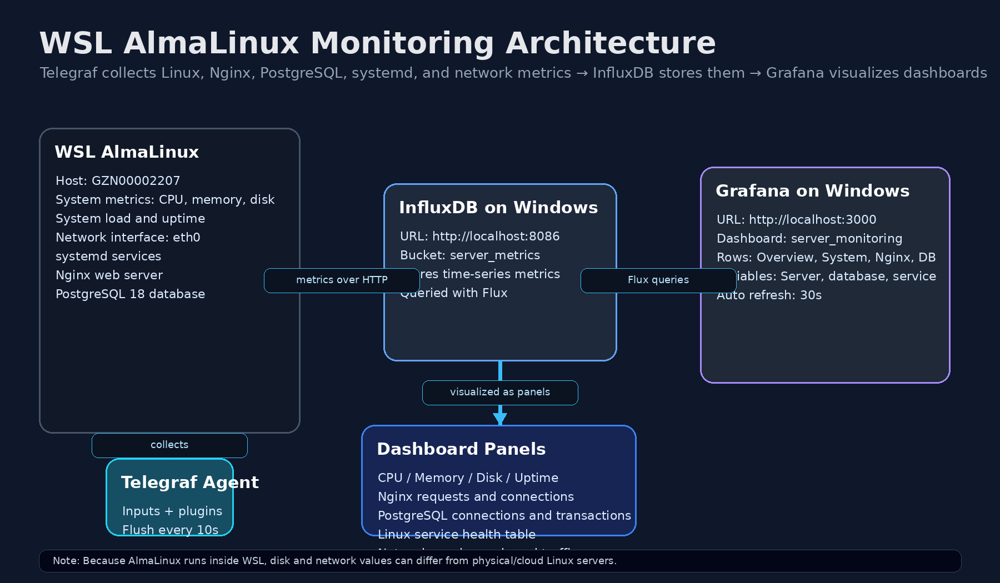

# WSL AlmaLinux Infrastructure Monitoring with Telegraf, InfluxDB, and Grafana

This project demonstrates a real-time infrastructure monitoring setup using AlmaLinux running on WSL, Telegraf as the metrics collector, InfluxDB as the time-series database, and Grafana for visualization.

## Architecture

WSL AlmaLinux → Telegraf → InfluxDB on Windows → Grafana on Windows

## What This Monitors

- CPU usage
- Memory usage
- Disk usage
- System load
- Nginx active connections
- Nginx requests
- PostgreSQL connections
- PostgreSQL transactions
- Linux systemd service health
- Network traffic

## Tech Stack

- AlmaLinux on WSL
- Telegraf
- InfluxDB
- Grafana
- Nginx
- PostgreSQL 18
- Flux queries

## Dashboard Preview

## Key Features

- Real-time server metrics collection
- Service-level monitoring for Nginx and PostgreSQL
- Systemd service health table
- Dashboard variables for server, database, and service filtering
- Clean Grafana dashboard layout with overview, system, database, web server, service, and network sections

## Project Architecture

## Setup Summary

1. Install InfluxDB and Grafana on Windows.
2. Install Telegraf on AlmaLinux WSL.
3. Configure Telegraf outputs to send metrics to InfluxDB.
4. Enable Telegraf inputs for CPU, memory, disk, system, nginx, PostgreSQL, systemd, and network.
5. Connect Grafana to InfluxDB.
6. Import the Grafana dashboard JSON.
7. Visualize real-time metrics.

## Notes

This project runs AlmaLinux inside WSL, so some hardware-level metrics such as disk and network may behave differently compared to a physical Linux server or cloud VM.

## Dashboard Sections

- Overview
- System Performance
- Nginx Monitoring
- PostgreSQL Monitoring
- Linux Service Health
- Network Monitoring

## Author

Gnaneshwar Reddy Vemunuri
